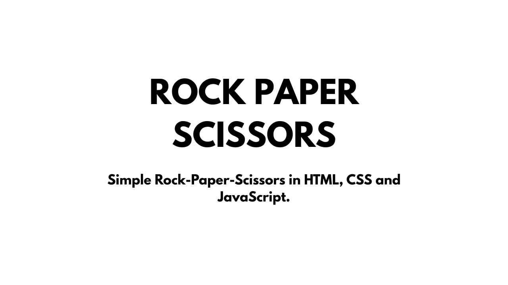

# ✊🖐️✌️ Rock Paper Scissors 

A simple Rock Paper Scissors game built with **HTML, CSS, and JavaScript**.  
Play against the computer and keep track of your score with persistent storage.

---

## 🎥 Watch the Demo
[](https://www.youtube.com/watch?v=cu5PvZ-UYTQ&list=PL3rikoZv2_R8hFEGWvHXemfvgo8hjK3u4&index=3)

---

## ⚙️ Build and Run

1. Clone the repository:
   ```bash
   git clone https://github.com/pedroguedes-cs/rock-paper-scissors.git
   cd rock-paper-scissors
   ```
2. Open game.html in your browser:

- Just double-click the file, or
- Serve it locally with Live Server (VS Code extension recommended).

---

## ⚖️ License
This project is licensed under the [MIT License](LICENSE).
